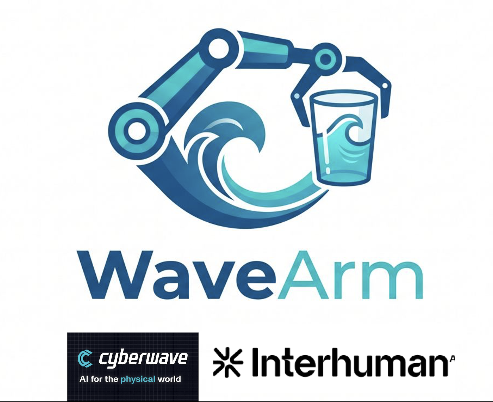

# SO-101 Gesture Control: WaveArm
<p align="center">

<\p>
> Control a robotic arm with hand gestures — MediaPipe + Cyberwave SDK.

Point your finger and the SO-101 moves. No wearables, no calibration, no complex mapping.
A webcam reads your hand gesture, the system confirms it, and the robot executes.

Built at [hackathon](https://luma.com/mmc68m0b?locale=it) speed, designed for extensibility.

[Demo Video](https://youtu.be/32ebCxhgnBs?si=yqWxutw_IAdO-RMf)

---

## How it works

```
Perceive → Reason → Act → Perceive → ...

Webcam → MediaPipe Hand Tracking → Gesture Classifier → Command Dispatcher → Cyberwave SDK → SO-101
```

1. **PERCEIVE** — MediaPipe detects hand landmarks + reads back robot joint state
2. **REASON** — gesture is confirmed only after N consecutive frames (no accidental triggers); command is checked against joint limits
3. **ACT** — incremental joint delta sent to SO-101 via Cyberwave

## Gesture map

| Gesture | Action |
|---------|--------|
| ☞ Index right | Pan arm right (J1 +) |
| ☜ Index left  | Pan arm left  (J1 −) |
| ☝ Index up    | Raise arm     (J2 +) |
| ↓ Index down  | Lower arm     (J2 −) |
| ✌ Peace sign  | Open gripper  (J6 +) |
| ✊ Fist        | Close gripper (J6 −) |
| 👍 Thumbs up  | Go home       |
| ✋ Open palm   | Stop / hold   |

---

## Quick Start

### 1. Install dependencies

```bash
pip install -r requirements.txt
```

### 2. Set up Cyberwave credentials

```bash
cp .env.example .env
# Edit .env and add your CYBERWAVE_API_KEY
```

### 3. Run the demo (no hardware needed)

```bash
python demo/demo_sim.py
```

You'll see joint angles printed in the terminal — this validates the pipeline without any robot or camera.

### 4. Run with camera in dry-run mode

```bash
python src/main.py --mode dry_run --debug
```

A window opens with your webcam. Hold a T-pose for 2 seconds to calibrate, then move your right arm and watch joint values update.

### 5. Run against the Cyberwave digital twin

```bash
python src/main.py --mode simulation --robot your-twin-id --debug
```

### 6. Run on the physical SO-101

```bash
# First: pair your robot
cyberwave pair

# Then run
python src/main.py --mode real --robot your-robot-name
```

---

## Project structure

```
SO101-MirrorArm/
├── src/
│   ├── main.py                 # Entry point — PRA loop
│   ├── gesture_classifier.py   # MediaPipe hand → Gesture enum (rule-based, no ML)
│   ├── command_dispatcher.py   # Gesture → incremental joint command
│   ├── reasoner.py             # Safety checks, rate limiting, error tracking
│   ├── robot_controller.py     # Cyberwave SDK wrapper (sim/real/dry_run)
│   └── pose_tracker.py         # (kept) full arm tracking for future use
├── config/
│   └── so101.yaml              # Joint limits and robot settings
├── demo/
│   ├── test_gestures.py        # Test gesture detection live (no robot needed)
│   ├── test_camera.py          # Test camera + hand tracking
│   └── demo_sim.py             # Synthetic demo without hardware
├── tests/
│   └── test_mapper.py          # Unit tests
├── .env.example                # Credentials template
└── requirements.txt
```

---

## CLI options

| Flag | Default | Description |
|------|---------|-------------|
| `--mode` | `dry_run` | `simulation`, `real`, or `dry_run` |
| `--robot` | `so-101-twin` | Cyberwave robot / twin name |
| `--cam` | `0` | Camera index |
| `--fps` | `30` | Target frames per second |
| `--smooth` | `0.4` | Joint smoothing (0 = off, 0.9 = max) |
| `--no-hands` | off | Disable hand tracking (faster inference) |
| `--debug` | off | Show camera window with skeleton overlay |

---

## Calibration

On startup, hold a **T-pose** (arm extended straight sideways) for **2 seconds**. The system records this as the neutral reference — all joint angles are computed relative to it. Press **C** at any time to recalibrate.

---

## Extending the project

- **Better wrist roll**: add a depth camera (RealSense / ZED) — the MediaPipe z-axis is a rough estimate.
- **More joints**: extend `joint_mapper.py` with hip/torso landmarks for a full upper-body mirror.
- **AI control**: replace the mapper with a policy model from the Cyberwave model catalog, trained on demonstration data.
- **Record & replay**: use Cyberwave's built-in data recording (exports to LeRobot/parquet) to collect training data.

---

## Tech stack

| Layer | Tool |
|-------|------|
| Pose estimation | MediaPipe (Google) |
| Robot SDK | Cyberwave |
| Computer vision | OpenCV |
| Robot | SO-101 (6 DoF arm) |
| Language | Python 3.10+ |

---

## License

MIT
